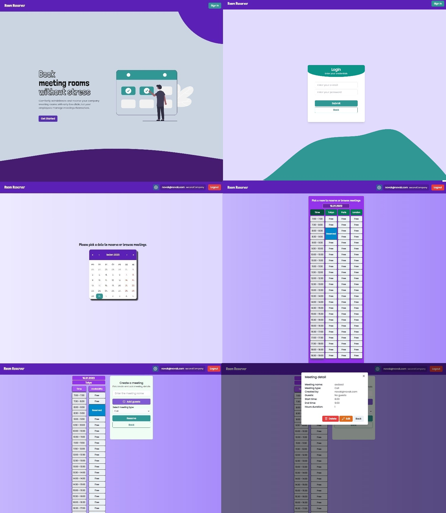

# 👔 Meeting Room Reservation System

## 🔸 Demo

You can try the demo [HERE](https://lukasthevicious.github.io/meeting-rooms-reservation/) based on following data:

```diff
+ login: novak@novak.com
+ password: 123123
```



## 🔸 Key Features

Personal project of meeting room reservation system for companies.

**Features**

1. User uses this app when he needs to book a meeting room for upcoming meeting or see/edit meeting details (time, meeting type, guests, meeting creators)
2. User is able to pick a day, see **all company meeting rooms together** (divided into 30 minutes time blocks from 7AM to 7PM).
3. One room is then picked for detailed view. In this view user is able to
   1. Book a meeting (by clicking on time blocks, which he would like to reserve and filling meeting form)
   2. View reserved meetings
   3. Edit reserved meetings in case, that the User is also Creator of that meeting
   4. Delete meeting in case, that the User is also Creator of that meeting
4. If the user has also Admin rights, he is able to manage (add and delete) **meeting** **rooms** and **users** for his company

**Steps**

1. **The company** and one **Admin user** is created and assigned externally (…after contacting the app provider through the contact form and agreeing on terms)
2. That Admin user is then able to:
   1. Manage his company's meeting rooms (adding, deleting)
   2. Manage users (adding, deleting) and assigning the roles (Admin or User)

## 🔸 Configuration and setup

In order to run this project locally, simply fork and clone the repository or download as zip and unzip on your machine.

- Open the project in your prefered code editor.

Create .env file in the root of your directory. Add:

```
REACT_APP_FIREBASE_API_KEY = *your Firebase API key*
```

```
$ npm install (to install dependencies)
& npm start (to start the client)
```

## 🔸 Main technologies used

- <b>Frontend:</b>
  [React](https://reactjs.org/), [Typescript](https://www.typescriptlang.org/), [Chakra UI](https://chakra-ui.com/), [Tailwind CSS](https://tailwindcss.com/)
- <b>Backend:</b>
  [Firebase](https://firebase.google.com/)
- <b>Hosting:</b>
  [GH pages](https://pages.github.com/)

## 🔸 Known issues

- Firebase backend security rules optimalization - work in progress

## 🔸 Future

- User is not able to create meeting in the past dates
